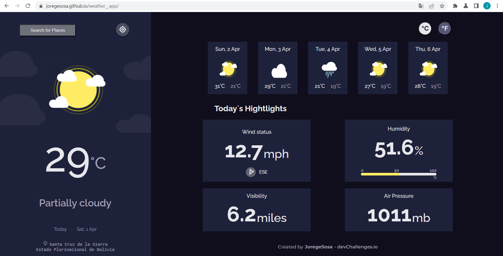

<!-- Please update value in the {}  -->

<h1 align="center">{Your project name}</h1>

<div align="center">
   Solution for a challenge from  <a href="http://devchallenges.io" target="_blank">Devchallenges.io</a>.
</div>

<div align="center">
  <h3>
    <a href="https://Joregesosa.github.io/weather__app">
      Demo
    </a>
    <span> | </span>
    <a href="https://github.com/Joregesosa/weather__app">
      Solution
    </a>
    <span> | </span>
    <a href="https://devchallenges.io/challenges/mM1UIenRhK808W8qmLWv">
      Challenge
    </a>
  </h3>
</div>

<!-- TABLE OF CONTENTS -->

## Table of Contents

- [Overview](#overview)
  - [Built With](#built-with)
- [Features](#features)
- [How to use](#how-to-use)
- [Contact](#contact)
- [Acknowledgements](#acknowledgements)

<!-- OVERVIEW -->

## Overview



Introduce your projects by taking a screenshot or a gif. Try to tell visitors a story about your project by answering:

you can see the demo in https://Joregesosa.github.io/weather__app

It was an amazing experience developing this app; it was the first time I consumed an API and I really enjoyed the process. I learned about consuming APIs, and now I know I need to learn about handling errors.

### Built With

<!-- This section should list any major frameworks that you built your project using. Here are a few examples.-->

- [React](https://reactjs.org/)

## Features

<!-- List the features of your application or follow the template. Don't share the figma file here :) -->

This application/site was created as a submission to a [DevChallenges](https://devchallenges.io/challenges) challenge. The [challenge](https://devchallenges.io/challenges/mM1UIenRhK808W8qmLWv) was to build an application to complete the given user stories.

## How To Use

To clone and run this application, you'll need [Git](https://git-scm.com) and [Node.js](https://nodejs.org/en/download/) (which comes with [npm](http://npmjs.com)) installed on your computer. From your command line:

```bash
# Clone this repository
$ git clone https://github.com/your-user-name/your-project-name

# Install dependencies
$ npm install

# change the homepage atributo at package.json
# example to deploy on gitHub hompage "https://nombre.github.io/weather__app";

# deploy app
$ npm run deploy

#local start ap
$ npm start
```

## Acknowledgements

<!-- This section should list any articles or add-ons/plugins that helps you to complete the project. This is optional but it will help you in the future. For example: -->

- [Step to use geolocation api](https://developer.mozilla.org/en-US/docs/Web/API/Geolocation_API)
- [api documentation](https://www.visualcrossing.com/resources/documentation/weather-api/timeline-weather-api/)

## Contact

- email [email](joregesosa@gmail.com)
- GitHub [@joregesosa](https://github.com/Joregesosa)
- linkedin [@jorge-sosa-920499201](https://www.linkedin.com/in/jorge-sosa-920499201/)
